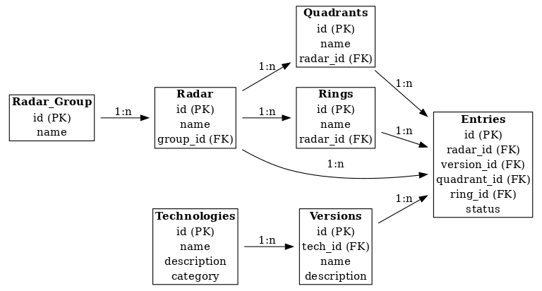

# arc42 Architektur-Dokumentation: Technologieradar

# 1. Einleitung und Ziele

## Aufgabenstellung
Entwicklung eines webbasierten Technologieradars, der Technologien (Programmiersprachen, Frameworks, Tools, Plattformen etc.) innerhalb eines Unternehmens oder Teams systematisch erfasst, bewertet und nachverfolgt.

## Qualitätsziele
- **Benutzerfreundlichkeit**: Einfache Bedienung für technische und nicht-technische Nutzer.
- **Skalierbarkeit**: Unterstützung wachsender Mengen an Technologien und Teams.
- **Wartbarkeit**: Leicht erweiterbar für neue Technologien und Bewertungsmodelle.
- **Sicherheit**: Geschützte Benutzerverwaltung und Berechtigungen.

## Stakeholder
- **Entwicklungsteam**: Implementierung und Pflege des Systems.
- **Teamleiter / CTO**: Nutzung zur Technologiebewertung und Entscheidungshilfe.
- **Mitarbeiter**: Beitrag zur Bewertung und Ergänzung neuer Technologien.

---

# 2. Randbedingungen

## Technische Randbedingungen
- Web-Anwendung, responsive Design.
- Backend: Java (Quarkus)
- Frontend: Vue.js (Vite)
- Authentifizierung via Keycloak.
- Hostbar in Kubernetes.

## Organisatorische Randbedingungen
- Agile Entwicklung (Scrum)
- Zweiwöchentliche Reviews mit Stakeholdern.

## Konventionen
- GitHub als Repository
- CI/CD via GitHub Actions
- Code-Konventionen nach Firmenstandard

---

# 3. Kontextabgrenzung

## Systemkontext

Das Technologieradar empfängt Eingaben von Nutzern und ermöglicht die visuelle Darstellung sowie die Auswertung von Technologie-Trends.

## Kontextdiagramm
(→ Platzhalter: Hier könntest du später ein einfaches Diagramm ergänzen.)

## Externe Systeme / Schnittstellen
- Keycloak (Authentifizierung)
- Postgresql Datenbanken für Technologien und Metadaten

---

# 4. Lösungsstrategie
- **Microservice-Ansatz**: Trennung zwischen Frontend und Backend.
- **Single Page Application (SPA)**: Frontend läuft komplett im Browser.
- **Eventuelle spätere Anbindung**: Exportfunktionen / Social Sharingfunktionen (z.B. Links Generieren / Möglichkeit Technologie ins eigene Skopos Techradar zu übernehmen).

---

# 5. Bausteinsicht

## Bausteinübersicht
- Frontend (Vue.js SPA)
- Backend-API (Quarkus, RESTful API)
- Datenbank (PostgreSQL)
- Authentifizierung (Keycloak, andere OIDC Provider)

## Ebene 1: Hauptbausteine
- **Frontend**: Visualisierung und Interaktion
- **Backend**: Logik, Business-Regeln
- **Datenbank**: Speicherung der Technologieeinträge und Bewertungen

### Ebene 2: Detaillierung wichtiger Bausteine
- Technologien sind in Quadranten und Ringen organisiert.
- Technologien haben Attribute wie Status (Adopt, Trial, Assess, Hold).

---

# 6. Laufzeitsicht

## Wichtige Abläufe

**Hinzufügen einer neuen Technologie**

1. Benutzer loggt sich ein (Keycloak).
2. Benutzer klickt auf "Neue Technologie hinzufügen".
3. Frontend sendet ein POST-Request an die API.
4. Backend prüft Rechte, validiert Eingaben.
5. Backend speichert Technologie in der Datenbank.
6. Frontend aktualisiert die Darstellung.

//TODO: weiterer Abläufe

# 7. Verteilungssicht

## Technische Infrastruktur
- Kompilierte Frontenddaten werden nach dem Bauen mit Quarkus bereitgestellt. 
- TODO: welcher Ordner ist der Quarkus Server static site ordner? 
- Backend-API läuft mit Quarkus als Container in Kubernetes.
- Datenbank als verwalteter Dienst (z.B. AWS RDS). //TODO korriegieren 

### Zuordnung
- Frontend kommuniziert über HTTPS mit der API.
- API authentifiziert Requests über OIDC (Keycloak).

---

# 8. Generelle Konzepte

## Datenmodell

## Authentisierung

Authentisierung geschieht über die Quarkus OIDC Integration. Der Provider muss im File `application.properties` einstellt werden. 

//TODO genauer erkläre, evtl. auch die Sache mit den DevServices 

## Styling / Corporate Design 

Das Styling von Radar und Applikation wird in einem zentralen CSS-File gesteuert. 
//TODO beschreiben wie wo genau. 

## Automatisches Testing 

Die Applikation verwendet Automatische End-zu-End Tests, die auf QuarkusTest basieren. Diese Tests werden im DevMode (kontinuerlich) und während der Build-Phase ausgeführt. 

# 9. Architekturentscheidungen

| Entscheidung | Begründung | Alternative |
| ------------ | ---------- | ----------- |
| Quarkus für Backend | Codebase bereits auf Quarkus | Spring Boot |
| Vue.js für Frontend | gute Integration, Vorwissen des Entwicklungsteam | //TODO Vorschlag von rschumm einfügen |
| Keycloak für Authentifizierung | Open Source, Standardkonform, einfach zu integrieren | Auth0, eigene Lösung |

---

# 10. Qualitätsanforderungen

## Qualitätsbaum
- **Performance**: Antwortzeiten <500ms
- **Security**: DSGVO-konforme Datenhaltung
- **Usability**: Selbsterklärende Bedienung

## Wichtigste Qualitätsszenarien
- Viele gleichzeitige Benutzer können Technologien hinzufügen und bewerten, ohne Performanceprobleme.
- Bei einem Ausfall von Keycloak soll ein Failover-Modus definiert sein.

... //TODO dies waren keine Anforderungen, jedoch: 

- Mühelose Installation mit Kubernetes und "von Hand / bare Metal"
- Mühelose Integration in OIDC IDP (e. g. Keycloak)
- etc. 

---

# 11. Risiken und technische Schulden

- Abhängigkeit von Keycloak: Erfordert Know-how im Team.
- Mangelnde Dokumentation der API könnte zu Missverständnissen führen.
- Technologiewachstum: Zu viele Technologien könnten die Übersichtlichkeit beeinträchtigen.
- Unzureichende Performance-Optimierung: Hohe Last könnte zu langsamen Antwortzeiten führen.

---

# 12. Glossar

| Begriff | Definition |
| ------- | ---------- |
| Technologie | Software oder Plattform, die bewertet wird. |
| Quadrant | Kategorisierung, z.B. Programmiersprachen, Tools, Plattformen. |
| Ring | Reifegrad der Technologie (Adopt, Trial, Assess, Hold). |